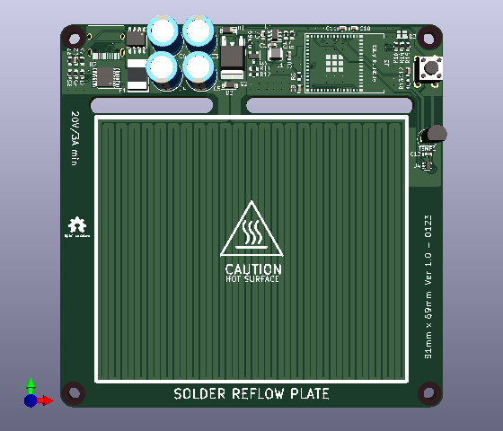
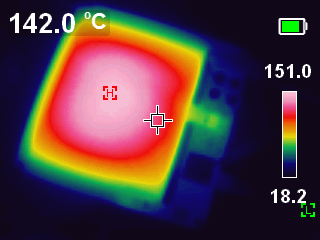
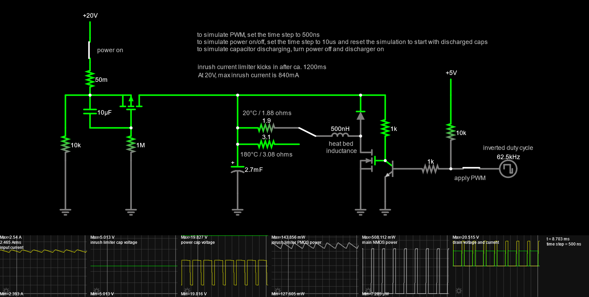

# reflow-solder-hot-plate
 USB-C powered, esp32s3 based, hot plate

  

  

## Before anything else:

:exclamation: :boom:

Make sure you understand the risks involved on this project as you will be dealing with high temperatures and high-ish voltages.

It is important that the power supply used is able to supply enough current, otherwise it will crash, if you got the board from me it should be fine, otherwise adjust the values on `lib/temp_control/temp_control.h`

### TODO

* Save readings on a vector so it reloads the graph in case you leave the webpage;
* Websocket terminal;
* Use the button to trigger reflow;

### Main CPU

I used the the following board because that is what I had on my drawer:

### Reflow profile

It takes 3x temperature "profiles" as arguments, just to keep it simple

  

### Duty cycle and Supply current

With a duty cycle of 78% (PWM is inverted), it results in 22% of the total power and at 20V it should draw ~2.16A

  

https://tinyurl.com/2pvo2wyf

### Known issues

* Because of the mosfet logic and high current, when plugged to the computer, the USB-A port will probably struggle to deliver power and will rover around 3.6V, which is not enough to feed the Buck-Converter, that will result in the ESP32 to not wake up and the Mosfet will be constantly ON :exclamation: :exclamation: :exclamation:

* For the reason mentioned above, it need to be programed via RX/TX test points under the board;

* RX connects to RX and TX connects to TX :disappointed:
